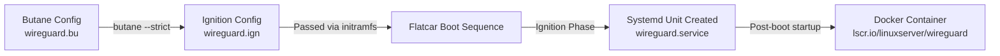

# Flatcar App — WireGuard VPN

[](https://www.flatcar.org)
[](https://coreos.github.io/butane/)
[](LICENSE)
[](https://github.com/flatcar/flatcar)

A production-grade reference implementation of running **WireGuard** as an immutable, containerized service on **Flatcar Container Linux**, provisioned declaratively via **Butane** and **Ignition**.

Created in response to Flatcar Container Linux "Good First Issue": [flatcar/Flatcar#2029 (Build a Flatcar App)](https://github.com/flatcar/Flatcar/issues/2029).

---

## 📐 Architecture Overview

Flatcar Container Linux enforces a read-only root filesystem (`/usr`). Rather than installing packages imperatively at runtime (e.g., via `apt` or `yum`), services are declared using Butane YAML, compiled to Ignition JSON specs, and launched at initial boot as `systemd` oneshot units running containerized workloads.



---

## ✨ Features & Design Highlights

- **Declarative Provisioning**: Uses `variant: flatcar`, `version: 1.1.0` Butane specification.
- **Systemd Service Integration**: `wireguard.service` managed as a `Type=oneshot` systemd unit ordered `After=docker.service`.
- **Persistent State & Configs**: Maps persistent storage (`/opt/wireguard/config`) to `/config` inside the container to preserve WireGuard keys and client configs across reboots.
- **Kernel Capability Delegation**: Grants `NET_ADMIN` and `SYS_MODULE` capabilities required for kernel-level WireGuard interface creation and routing.
- **Multi-Arch Verification**: Tested natively on Flatcar Container Linux across ARM64 (Apple Silicon QEMU HVF) and AMD64 architectures.

---

## 🚀 Quickstart Guide

### 1. Prerequisites

- [`butane`](https://coreos.github.io/butane/getting-started/) (CLI tool to transpile Butane YAML to Ignition JSON)
- `qemu-system-aarch64` or `qemu-system-x86_64` (or any cloud provider supporting Ignition)

### 2. Transpile Butane Configuration

Replace `<YOUR_SSH_PUBLIC_KEY>` in `wireguard.bu` with your actual SSH public key (`cat ~/.ssh/id_ed25519.pub`), then transpile:

```bash
butane --strict wireguard.bu > wireguard.ign
```

### 3. Deploy on Flatcar (QEMU Launcher Script)

Download the Flatcar QEMU launcher script and boot image:

```bash
CHANNEL=alpha
VERSION=current

curl -LO "https://${CHANNEL}.release.flatcar-linux.net/arm64-usr/${VERSION}/flatcar_production_qemu_uefi.sh"
curl -LO "https://${CHANNEL}.release.flatcar-linux.net/arm64-usr/${VERSION}/flatcar_production_qemu_uefi_efi_code.qcow2"
curl -LO "https://${CHANNEL}.release.flatcar-linux.net/arm64-usr/${VERSION}/flatcar_production_qemu_uefi_efi_vars.qcow2"
curl -LO "https://${CHANNEL}.release.flatcar-linux.net/arm64-usr/${VERSION}/flatcar_production_qemu_uefi_image.img"

chmod +x flatcar_production_qemu_uefi.sh
```

Boot Flatcar with your Ignition configuration and SSH public key:

```bash
./flatcar_production_qemu_uefi.sh -i wireguard.ign -a ~/.ssh/id_ed25519.pub
```

> **macOS Apple Silicon / QEMU 11.x Troubleshooting**:
> If the wrapper script hangs during early boot at `UEFI firmware...`, pass Homebrew's native EDK2 firmware directly to QEMU via the `-bios` flag:
>
> ```bash
> qemu-system-aarch64 \
>   -machine virt,accel=hvf,gic-version=3 \
>   -cpu host -smp 4 -m 2048 \
>   -bios /opt/homebrew/share/qemu/edk2-aarch64-code.fd \
>   -drive if=none,id=blk,file=./flatcar_production_qemu_uefi_image.img,format=qcow2 \
>   -device virtio-blk-pci,drive=blk,bootindex=1 \
>   -netdev user,id=eth0,hostfwd=tcp::2222-:22 \
>   -device virtio-net-pci,netdev=eth0 \
>   -fw_cfg name=opt/org.flatcar-linux/config,file=./wireguard.ign \
>   -nographic
> ```
> For an in-depth breakdown of root-causing the QEMU 11.1 UEFI boot hang and DNS resolution fallback, see [DEBUGGING_WALKTHROUGH.md](DEBUGGING_WALKTHROUGH.md).

---

## 🔍 Verification & Inspection

Log into the booting Flatcar instance via SSH:

```bash
ssh -p 2222 core@localhost
```

### Check Systemd Service Status

```bash
systemctl status wireguard.service
```

*Expected Output:*
```text
● wireguard.service - WireGuard VPN via Docker
     Loaded: loaded (/etc/systemd/system/wireguard.service; enabled; preset: enabled)
     Active: active (exited) since Sun 2026-08-16 08:54:58 UTC
```

### Check Container Status

```bash
sudo docker ps
```

*Expected Output:*
```text
CONTAINER ID   IMAGE                                  COMMAND   CREATED         STATUS         PORTS                                             NAMES
a8ef0592d356   lscr.io/linuxserver/wireguard:latest   "/init"   5 seconds ago   Up 5 seconds   0.0.0.0:51820->51820/udp, [::]:51820->51820/udp   wireguard
```

### Inspect Container Logs

```bash
sudo docker logs wireguard
```

---

## 📁 Repository Structure

```text
.
├── wireguard.bu              # Source Butane YAML specification (variant: flatcar 1.1.0)
├── wireguard.ign             # Transpiled Ignition JSON payload
├── wireguard.service         # Standalone systemd oneshot unit
├── DEBUGGING_WALKTHROUGH.md  # Detailed debugging & deployment journey (macOS QEMU & DNS)
├── LICENSE                   # Apache 2.0 License
└── README.md                 # Primary documentation & quickstart guide
```

---

## 📄 License

Licensed under the [Apache License, Version 2.0](LICENSE).
