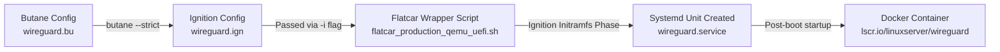

# Flatcar App — WireGuard VPN

A reference implementation of running **WireGuard** as an immutable, containerized service on **Flatcar Container Linux**, provisioned declaratively via **Butane** and **Ignition**.

Created in response to Flatcar "Good First Issue": [flatcar/Flatcar#2029 (Build a Flatcar App)](https://github.com/flatcar/Flatcar/issues/2029).

---

## Architecture Overview

Flatcar Container Linux uses a read-only root filesystem. Instead of installing packages imperatively at runtime, services are declared via Butane YAML, compiled to Ignition JSON, and started at boot time as systemd units running Docker containers.



---

## Features

- **Declarative Provisioning**: Uses `variant: flatcar`, `version: 1.1.0` Butane spec.
- **Systemd Integration**: `wireguard.service` managed as a `Type=oneshot` systemd unit ordered `After=docker.service`.
- **Persistent Storage**: Maps `/opt/wireguard/config` to `/config` inside the container.
- **Kernel Capabilities**: Grants `NET_ADMIN` and `SYS_MODULE` capabilities required for WireGuard interface creation and routing.
- **Tested & Verified**: Tested natively on Flatcar Container Linux (ARM64 & AMD64).

---

## Quickstart

### 1. Prerequisites

- `butane` (CLI tool to transpile YAML to Ignition JSON)
- `qemu-system-aarch64` or `qemu-system-x86_64` (or any cloud provider supporting Ignition)

### 2. Transpile the Butane Config

Replace `<YOUR_SSH_PUBLIC_KEY>` in `wireguard.bu` with your SSH public key (`cat ~/.ssh/id_ed25519.pub`), then transpile:

```bash
butane --strict wireguard.bu > wireguard.ign
```

### 3. Deploy on Flatcar (Standard Launcher Script)

Download the Flatcar QEMU launcher script and boot image:

```bash
CHANNEL=alpha
VERSION=current
curl -LO "https://${CHANNEL}.release.flatcar-linux.net/arm64-usr/${VERSION}/flatcar_production_qemu_uefi.sh"
curl -LO "https://${CHANNEL}.release.flatcar-linux.net/arm64-usr/${VERSION}/flatcar_production_qemu_uefi_efi_code.qcow2"
curl -LO "https://${CHANNEL}.release.flatcar-linux.net/arm64-usr/${VERSION}/flatcar_production_qemu_uefi_efi_vars.qcow2"
curl -LO "https://${CHANNEL}.release.flatcar-linux.net/arm64-usr/${VERSION}/flatcar_production_qemu_uefi_image.img"
chmod +x flatcar_production_qemu_uefi.sh
```

Boot Flatcar with your Ignition configuration and SSH public key:

```bash
./flatcar_production_qemu_uefi.sh -i wireguard.ign -a ~/.ssh/id_ed25519.pub
```

> **Troubleshooting Note for macOS ARM64 / QEMU 11.x**:
> If the wrapper script hangs during early boot (`UEFI firmware...`), pass Homebrew's native edk2 bios directly to QEMU via the `-bios` flag:
> ```bash
> qemu-system-aarch64 \
>   -machine virt,accel=hvf,gic-version=3 \
>   -cpu host -smp 4 -m 2048 \
>   -bios /opt/homebrew/share/qemu/edk2-aarch64-code.fd \
>   -drive if=none,id=blk,file=./flatcar_production_qemu_uefi_image.img,format=qcow2 \
>   -device virtio-blk-pci,drive=blk,bootindex=1 \
>   -netdev user,id=eth0,hostfwd=tcp::2222-:22 \
>   -device virtio-net-pci,netdev=eth0 \
>   -fw_cfg name=opt/org.flatcar-linux/config,file=./wireguard.ign \
>   -nographic
> ```
> For a complete step-by-step breakdown of how this and DNS resolution were debugged, see [DEBUGGING_WALKTHROUGH.md](DEBUGGING_WALKTHROUGH.md).

---

## Verification

Log into the Flatcar instance via SSH:

```bash
ssh -p 2222 core@localhost
```

### Check Systemd Service Status

```bash
systemctl status wireguard.service
```

Output:
```text
● wireguard.service - WireGuard VPN via Docker
     Loaded: loaded (/etc/systemd/system/wireguard.service; enabled; preset: enabled)
     Active: active (exited) since Sun 2026-08-16 08:54:58 UTC
```

### Check Docker Container Status

```bash
sudo docker ps
```

Output:
```text
CONTAINER ID   IMAGE                                  COMMAND   CREATED         STATUS         PORTS                                             NAMES
a8ef0592d356   lscr.io/linuxserver/wireguard:latest   "/init"   5 seconds ago   Up 5 seconds   0.0.0.0:51820->51820/udp, [::]:51820->51820/udp   wireguard
```

### Check WireGuard Container Logs

```bash
sudo docker logs wireguard
```

---

## Repository Structure

```text
.
├── wireguard.bu              # Butane YAML source configuration
├── wireguard.ign             # Compiled Ignition JSON
├── DEBUGGING_WALKTHROUGH.md  # Detailed debugging & deployment journey
├── LICENSE                   # Apache 2.0 License
└── README.md                 # Primary documentation and usage guide
```

---

## License

Licensed under the [Apache License, Version 2.0](LICENSE).
